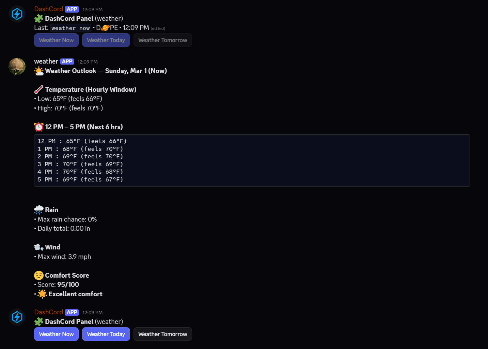
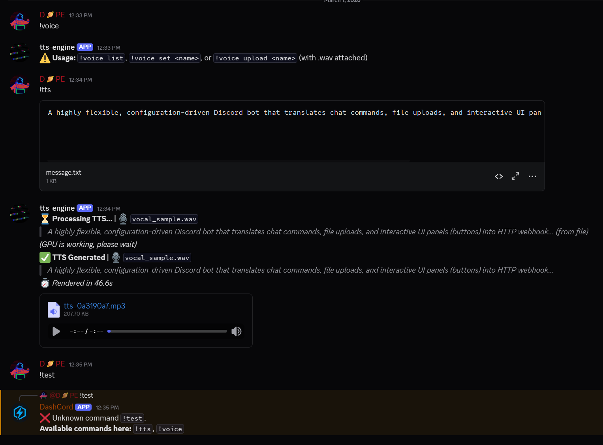
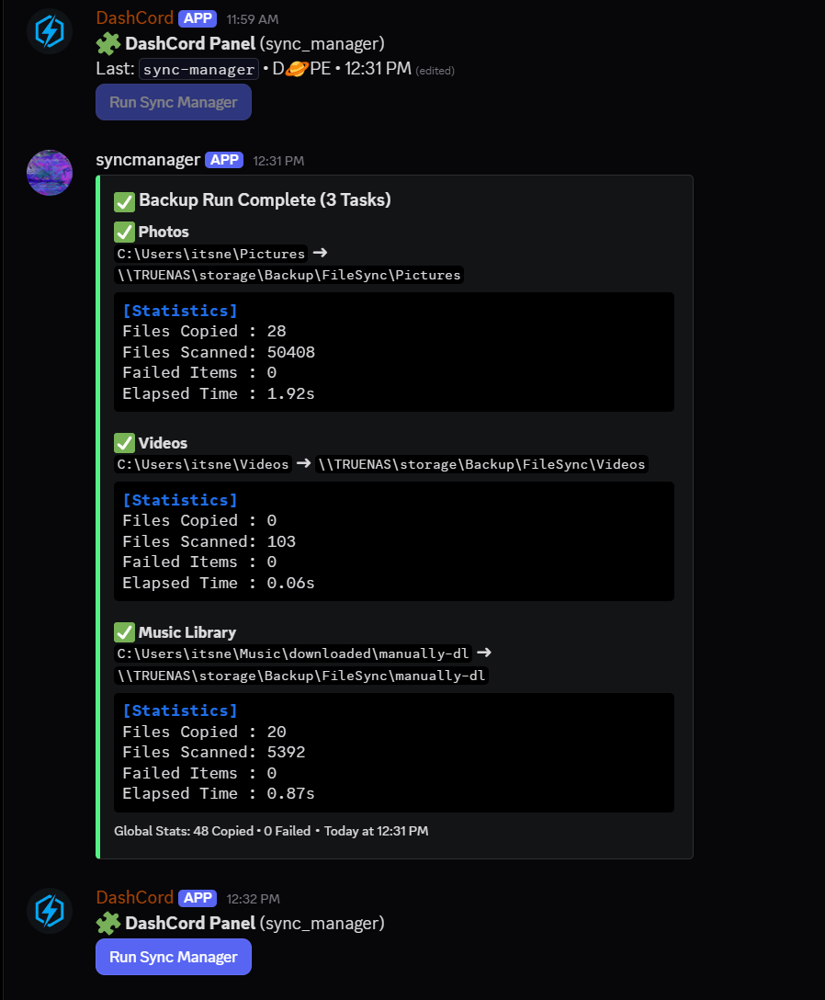
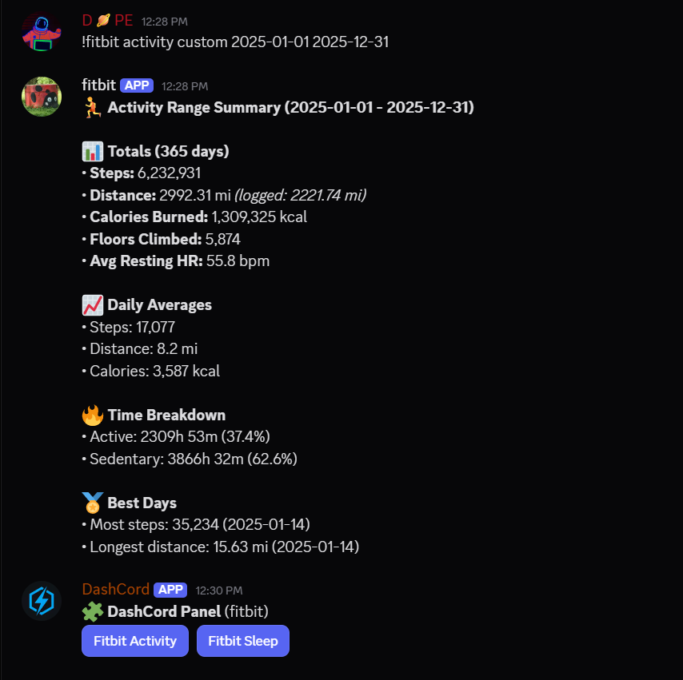

<p align="center">
  
</p>

# DashCord

A highly flexible, configuration-driven Discord bot that translates chat commands, file uploads, and interactive UI panels (buttons) into HTTP webhook requests. 

Originally built for **n8n**, this bot works flawlessly with **Make (Integromat), Zapier, Node-RED**, or any custom API. 

Instead of hardcoding new Discord commands every time you want to automate something, you simply define them in a `routes.json` file. The bot acts as a universal headless bridge between Discord and your automation platform.

| 🎛️ Interactive UI Panels | 📁 Advanced File Handling (TTS) |
| :--- | :--- |
|  |  |
| **📊 System Automation Logs** | **🏃 Manual Chat Commands** |
|  |  |

## ✨ Features

- **⚡ Dynamic Commands:** Add new slash-free commands (e.g., `!weather`, `!deploy`) just by editing a JSON file.
- **🎛️ Sticky Dashboard Panels:** Generate persistent UI button panels in specific channels. The bot can automatically "persist" these panels, moving them to the bottom of the chat so they never get buried. Users can click buttons to trigger workflows without typing.
- **📁 Intelligent File Fan-out:** Forward files directly to your webhooks. Can auto-parse JSON attachments, convert to Base64, and dynamically fan-out requests (upload 5 files, it triggers 5 separate webhook calls).
- **🎭 Dynamic Body Templating:** Inject Discord metadata (like `{{discord.user_display}}` or `{{discord.channel_id}}`) directly into the JSON payload sent to your webhook, molding the data to fit your API perfectly.
- **🔒 Security Built-In:** Restrict specific commands to specific Discord channels or user IDs. Secures outbound requests with a custom `X-DashCord-Token` header.
- **💬 Native Discord Replies:** Your webhook can respond with JSON containing plain text or rich Discord Embeds, and the bot will cleanly post it back to the channel.

---

## 🚀 Quick Start (Docker)

1. Clone the repository:
```bash
git clone https://github.com/yourusername/DashCord.git
cd DashCord
```

2. Setup Configuration:
```bash
cp .env.example .env
cp routes.json.example routes.json
```

3. Open `.env` and add your **Discord Bot Token**.

4. Configure your commands and endpoints in `routes.json`.

5. Run it (using the Docker Compose wrapper):
```bash
chmod +x start.sh
./start.sh
```
*(To view live logs, simply run `./logs.sh`)*

> **⚠️ CRITICAL SETUP STEP:** 
> Because this bot reads chat commands (`!weather`), you **must** enable the **Message Content Intent**.
> Go to the [Discord Developer Portal](https://discord.com/developers/applications) -> Your Bot -> **Bot** tab -> Scroll down to **Privileged Gateway Intents** -> Turn ON **Message Content Intent**.

---

## ⚙️ Configuration File (`routes.json`)

All routing logic is driven by `routes.json`. It has two main sections: `commands` and `panels`.

### 1. Defining a Command

Commands map a typed Discord message to a webhook URL.

```json
"commands": {
  "ping": {
    "endpoint": "https://your-automation-tool.com/webhook/ping",
    "method": "POST",
    "allowed_users": ["1234567890"],
    "allowed_channels":[]
  }
}
```
*Typing `!ping test` will send a POST request containing the arguments to that webhook. Because `allowed_users` has an ID, only that Discord user can trigger it.*

### 2. Defining File Uploads

You can allow commands to accept attachments, or even fire automatically when a specific filetype is uploaded without a command at all.

```json
"upload": {
  "endpoint": "https://your-webhook...",
  "method": "POST",
  "accept_attachments": true,
  "allow_without_command": true,
  "attachment_rules": {
    "extensions":[".json", ".csv"],
    "max_bytes": 2500000,
    "require_json": false
  }
}
```

### 3. Designing Interactive UI Panels

Panels create persistent messages with buttons. You can bind specific commands and background arguments to each button.

```json
"panels": {
  "Server_Controls": {
    "channels":["1029384756"],
    "buttons":[
      {
        "label": "Restart Server",
        "command": "ping",
        "args": ["restart"],
        "style": "danger"
      },
      {
        "label": "Check Status",
        "command": "ping",
        "args": ["status"],
        "style": "primary"
      }
    ]
  }
}
```
**Button Styles Available:**
| Style Name | Discord Color | Best Used For |
| :--- | :--- | :--- |
| `primary` | Blurple (Blue) | Main actions |
| `secondary`| Grey | Neutral / Informational |
| `success` | Green | Confirmations / Starts |
| `danger` | Red | Restarts / Stops / Deletes |

*Note: Clicking the "Restart Server" button above executes the `ping` command with the argument `restart` behind the scenes, exactly as if the user typed `!ping restart`.*

### 4. Dynamic Body Templating (Optional)

If you need a specific payload structure rather than the default, you can define a `body_template` in your command configuration. DashCord will automatically fill in the `{{placeholders}}`:

```json
"commands": {
  "alert": {
    "endpoint": "https://your-webhook...",
    "method": "POST",
    "body_template": {
      "priority": "high",
      "triggered_by": "{{discord.user_display}}",
      "source_channel": "{{discord.channel_name}}",
      "original_text": "{{raw}}",
      "file_data": "{{attachment_b64}}"
    }
  }
}
```

---

## 📦 What your Webhook Receives (Payload format)

Whenever a command or button is triggered (and no custom template is used), your Webhook will receive a JSON POST payload like this:

```json
{
  "source": "discord",
  "event_type": "command", 
  "command": "ping",
  "args": ["restart", "now"],
  "raw": "!ping restart now",
  "timestamp": "2026-02-25T12:00:00-05:00",
  "discord": {
    "guild_id": "123456...",
    "channel_id": "123456...",
    "user_id": "123456...",
    "user_display": "CoolUser"
  },
  "attachment_b64": "..." 
}
```

> **🔑 Authentication Header**
> The bot sends the `DASHCORD_SHARED_SECRET` (from your `.env` file) as a custom header:
> `X-DashCord-Token: your_secret_here`
> *Ensure your webhook validates this header so nobody else can trigger your endpoints!*
> 
> **💡 n8n Tip:** Most automation platforms (like Node.js & n8n) normalize HTTP headers to lowercase. You should look for `x-dashcord-token` in your expressions (e.g., `{{ $json.headers["x-dashcord-token"] }}`).

---

## 💬 Responding to Discord

Your webhook should respond with a **200 OK** status. To make the bot reply natively in Discord, return JSON from your webhook.

**Simple Text Reply:**
```json
{
  "reply": {
    "content": "✅ Server restart initiated!"
  }
}
```

**Rich Embed Reply:**
DashCord fully supports Discord embeds. Just pass an array of embed objects:
```json
{
  "reply": {
    "content": "Server Status Check:",
    "embeds":[
      {
        "title": "CPU Usage",
        "description": "Currently running at 45% capacity.",
        "color": 65280
      }
    ]
  }
}
```

*(If you do not want the bot to reply at all, return `{"reply": {"suppress": true}}` or just an empty 200 OK).*

---

### 🔧 Pro Configuration (.env)

DashCord is highly customizable. You can fine-tune exactly how the bot, your webhooks, and your interactive panels behave by modifying your `.env` file. 

#### 🤖 General Bot Settings
- `DISCORD_TOKEN`: **(Required)** Your Discord Bot Token.
- `COMMAND_PREFIX`: The prefix used for typed commands in chat (Default: `!`).
- `TIMEZONE`: The timezone used for panel timestamps and payload metadata (Default: `America/New_York`).
- `DISPLAY_UNKNOWN_COMMAND_ERROR`: If a user mistypes a command (e.g., `!wether`), the bot will reply with a helpful list of commands they actually have permission to use (Default: `true`).
- `DASHCORD_DEBUG`: Enables verbose internal debug logging in the console (Default: `false`).
- `ROUTES_PATH`: The file path to your routing configuration (Default: `routes.json` in the bot's root directory).

#### 🌐 Webhook & API Settings
- `DASHCORD_SHARED_SECRET`: A secret string sent as the `X-DashCord-Token` HTTP header to secure your webhooks from unauthorized requests.
- `HTTP_TIMEOUT_SECONDS`: How long the bot waits for your webhook to respond before throwing a timeout error (Default: `20`).
- `VERIFY_TLS`: Whether to verify SSL/TLS certificates when hitting your webhook URLs. Set to `false` if you are using self-signed certs on a local network (Default: `true`).
- `DEBUG_WEBHOOK`: Prints beautifully formatted, raw webhook request and response payloads directly to the console for API troubleshooting (Default: `false`).

#### 🎛️ Panel Interaction & Spawning
- `PANEL_SPAWN_NEW_ON_CLICK`: Post a fresh copy of the panel at the bottom of the chat automatically after a user clicks a button (Default: `true`).
- `PANEL_STATUS_LINE`: When a button is clicked, update the old panel's text to show an audit log of who clicked it (e.g., `Last: !ping restart • CoolUser • 4:05 PM`) (Default: `true`).
- `PANEL_ARCHIVE_DISABLE_BUTTONS`: When a button is clicked, permanently grey-out/disable the buttons on that specific message so users must use the newest panel at the bottom (Default: `true`).
- `PANEL_REPOST_ON_STARTUP`: When the bot boots up, it will scan channels to find your panels and "re-attach" itself to them so buttons keep working (Default: `true`).
- `PANEL_FORCE_NEW_ON_STARTUP`: Instead of editing the existing panel in-place on boot, the bot will delete the old one and post a brand new panel at the bottom of the chat (Default: `true`).

#### 🧹 Panel Persistence & Cleanup
*Persistence is the bot's ability to keep panels at the bottom of the chat so they don't get lost when users are talking.*
- `PANEL_PERSIST_DEFAULT`: The global default for whether panels should automatically "jump" to the bottom of the chat (Default: `false`). *(Note: You can override this per-panel in `routes.json`)*.
- `PANEL_PERSIST_INTERVAL_SECONDS`: How often the background loop checks if chat activity has buried your panels (Default: `45`).
- `PANEL_PERSIST_CLEANUP_OLD_ACTIVE`: When the bot moves a panel to the bottom of the chat, it deletes the old one to prevent duplicates (Default: `true`).
- `PANEL_DELETE_OLD_PANELS`: Allows the bot to mass-delete old, disconnected panels if things get messy (Default: `true`).
- `PANEL_SCAN_LIMIT`: How many messages up the chat history the bot will scan when looking for old panels to clean up (Default: `50`).